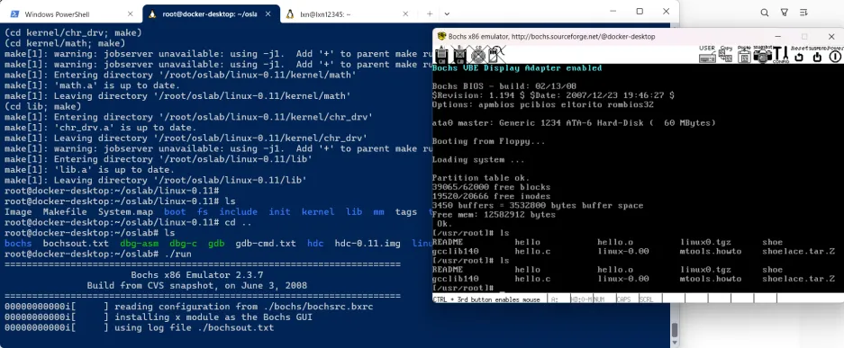
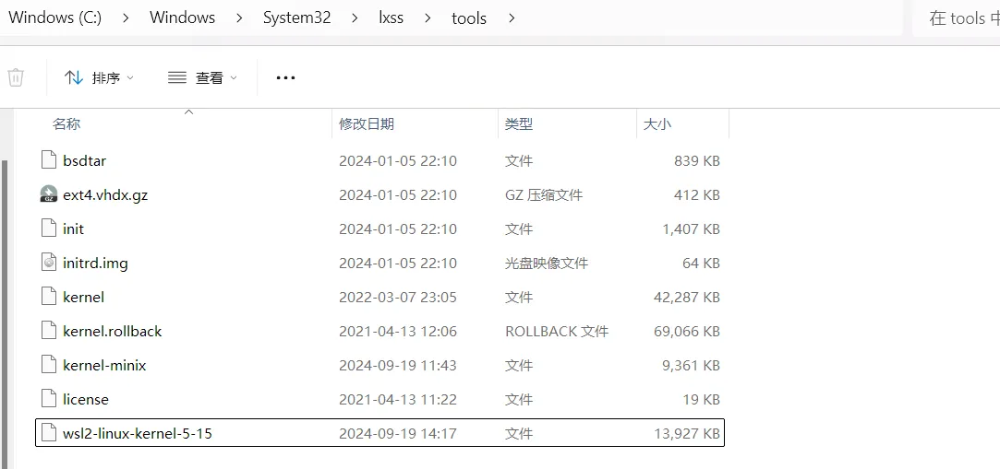
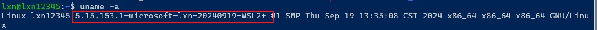

# learning oslab

这是哈工大计算机科学与技术学院李治军老师的操作系统课程实验环境

我们使用docker 来构建oslab的可运行环境，在wsl2上测试通过，欢迎大家在更多的环境上测试该docker image。<(￣︶￣)↗[GO!]>>

# get start
## build image 
1. 从[Dockerfile](./Dockerfile)中执行构建, 我们默认你已经安装好docker，无论通过docker desktop 或者在linux主机上
```shell
docker build -t lxn_oslab:1.0 .
```

2. 从dockerhub中直接拉取我们构建好的镜像(正在提供支持，coming soon)
```shell
docker pull lxn1234/lxn_oslab:1.0 
```
> Dockerfile 的构建参考[林夕`](https://blog.csdn.net/qq_45923646/article/details/120575616) 大佬的环境配置方法，感谢大佬写的文档

## run container

1. 首先，我们需要在主机上执行`xhost +` 
2. 通过`ifconfig` 获取主机的IP地址，记为`host_ip` 
3. 将`host_ip` 填入文件[run_oslab.sh](./run_oslab.sh) 中
```shell
# Run the OSLab programs
docker run --rm -it --network=host --name oslab  \
    --env="DISPLAY=<host_ip>:0.0" \
```
4. 运行oslab容器
```shell
./run_oslab.sh
```

## test
1. 安装[Xlaunch](https://sourceforge.net/projects/vcxsrv/),(在windows 上使用docker desktop 需要Xlaunch 可视化容器里面的GUI窗口)

下载安装Xluanch，使用默认配置启动xlaunch即可

> linux 环境下不需要安装这个Xlaunch，在容器里面使用`export DISPLAY=<host_ip>:0.0` 即可

2. 我们可以通过一个`x11-apps` 的小插件，来测试容器中的窗口转发, 以下操作我们在容器中进行
```shell
apt-get install -y x11-apps
xeyes
```
如果出现两只眼睛的窗口，则说明容器内部的窗口转发配置成功


2. 解压并编译oslab
```shell
tar -zxvf hit-oslab.tar.gz -C /root/
cd oslab/linux-0.11
make all -j 2
```
编译成功

3. 运行oslab操作系统
```shell
cd oslab
./run
```
将会出现操作系统加载窗口



# 踩坑日志
## 1. "unknown filesystem type 'minix'"
由于本实验环境使用WSL2 的Ubuntu20.04 + dockerdesktop，WSL2 中linux kernel在Microsoft 官方的设置下没有打开操作系统对 minix 文件系统的支持，所有需要为WSL2重新编译 linux kernel。看起来很复杂，别担心，只需要下面几个步骤就可以解决问题

参考链接:
[Microsoft/WSL2-linux-kernel](https://github.com/microsoft/WSL2-Linux-Kernel)
[WSL2中linux内核替换](https://blog.csdn.net/weixin_60738001/article/details/130739325)

可以使用任何linux分发版为WSL2 编译linux kernel，本次测试使用WSL2 ubuntu 20.04
1. 下载WSL2 linux kernel，通过-b拉取对应的分支
```shell
git clone -b linux-msft-wsl-5.15.y git@github.com:microsoft/WSL2-Linux-Kernel.git
```
2. 安装编译依赖
```shell
sudo apt install build-essential flex bison dwarves libssl-dev libelf-dev cpio
```

3. 使用WSL2内核配置构建内核：
编辑`Microsoft/config-wsl` 文件，设置操作系统支持minix 文件系统
```shell
CONFIG_MINIX_FS=y 
```
编译linux kernel
```shell
make KCONFIG_CONFIG=Microsoft/config-wsl -j 4
```
> config-wsl 可以修改linux kernel 的模块支持，例如 设置这个参数 CONFIG_MINIX_FS=y 可以使得操作系统内核支持 minix 文件系统，同时 设置 CONFIG_LOCALVERSION 可以设置操作系统内核uname 显示的系统信息

4. 编译完成会生成linux kernel为arch/x86/boot/bzImage，将该Linux kernel 拷贝到C:\Windows\System32\lxss\tools路径下 , 重命名为wsl2-linux-kernel-5-15


5. 设置WSL2的.wslconfig文件，指定自定义内核启动
.wslconfig文件路径为：`C:\Users\<用户名>\.wslconfig` 
为配置文件添加kernel内容
```shell
[wsl2]
kernel=C:\\Windows\\System32\\lxss\\tools\\wsl2-linux-kernel-5-15
```
完整的.wslconfig文件如下：
```shell
[wsl2]
kernel=C:\\Windows\\System32\\lxss\\tools\\wsl2-linux-kernel-5-15
networkingMode=mirrored    #bridged | mirrored
#vmSwitch=WSLBridge
ipv6=true
[experimental]
autoProxy=true
```
5. 重启WSL2，在powershell执行
```shell
wsl.exe --shutdown
wsl.exe 
```
6. 接下来在启动linux分发版，就可以查看内核信息
```shell
uname -a
```
